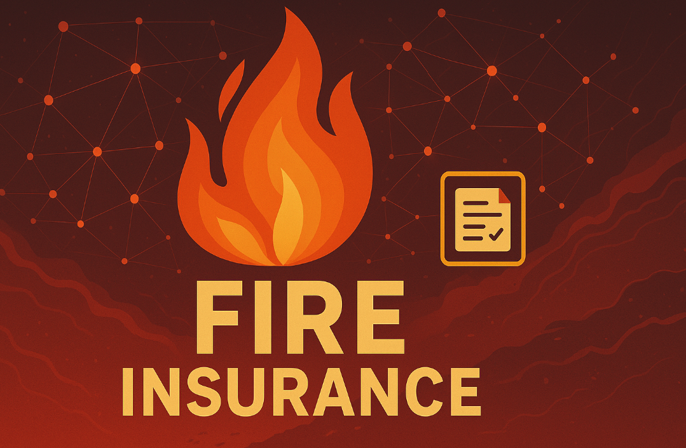
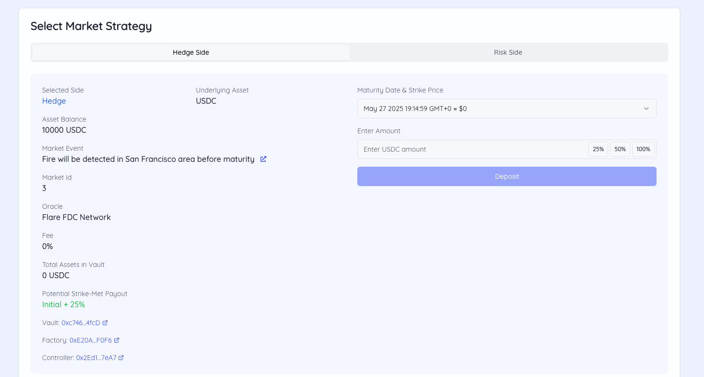
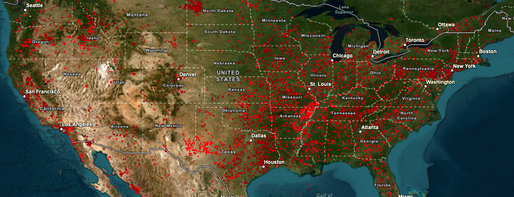
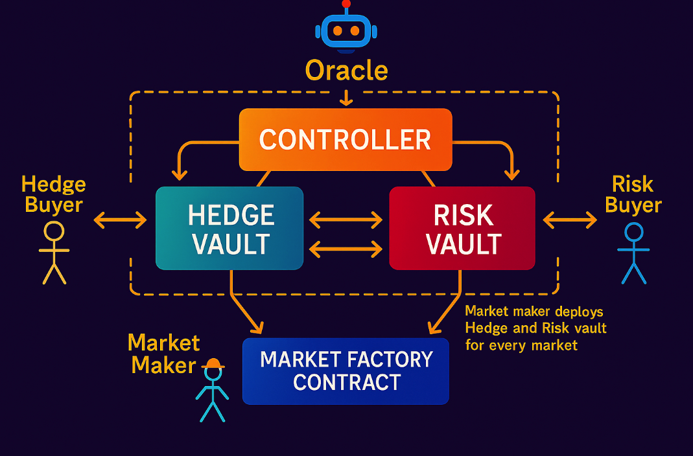
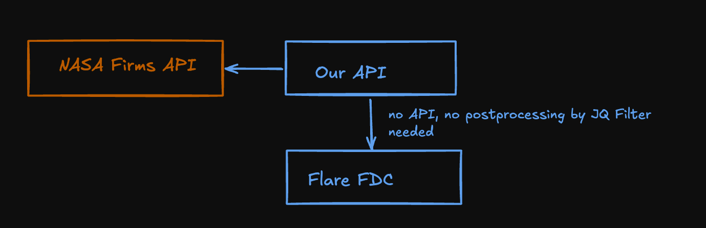
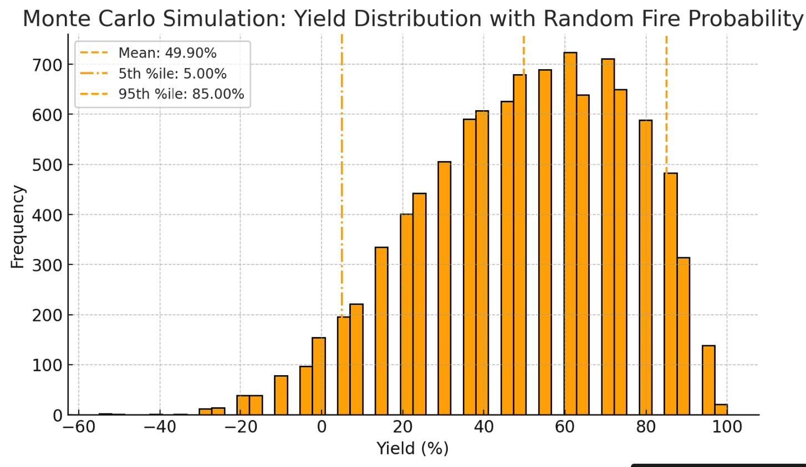

# 🔥 Ember Shield



## Demo 
https://ember-shield-git-main-enders-projects.vercel.app/



## What We're Building

We're building a **decentralized parametric fire insurance** solution on **Flare Network**, leveraging FDC's JsonAPI attestation type and satellite data from NASA's FRMS API. Our smart contracts and trusted oracles deliver **instant, transparent, and fair** payouts to communities in extreme wildfire zones—areas where traditional insurers have withdrawn.

> **Hackathon MVP:** a proof-of-concept to showcase the flexibility and speed of our framework—not a finished product, but a glimpse of what's coming. Alot of the functionalities are a WIP


> Note: I couldn’t get test USDC on Flare, so I deployed a mock ERC20 for testing; the protocol is inteded to work with any stablecoin, using USDC in UI only as a placeholder.

## Why It Matters

We have family near Paradise, Northern California—the town destroyed by the 2018 fire. Properties in the region are tagged "Extreme Risk" with **9/10 Fire Factor™** and up to **48% wildfire probability** over 30 years.

Here's a map of all active fires in September 2024 across the continental US, during the LA fire events:



Traditional insurers are pulling out, premiums are soaring, and claims processes drag on. Communities are left vulnerable and frustrated. The tragic case of **Luigi Mangione**, who turned to violence over a denied claim in a different insurance vertical, highlights the **opaque and adversarial** nature of today's industry. It's clear: insurance needs a complete reset.

## How It Works

- **Blockchain Backbone:** Built on Flare Network for low-cost, scalable contracts  
- **Real-Time Data:** FDC's JsonAPI pulls wildfire metrics directly from NASA's FRMS API  
- **Trustless Verification:** Satellite-verified data feeds enforce on-chain triggers  
- **Automated Payouts:** Claims settle the moment damage thresholds are met—no manual steps, no delays  

By combining reliable oracle data with smart-contract automation, Ember Shield turns a slow, opaque claims process into one that's **data-driven and instant**—bringing fairness back to wildfire insurance.


## Architecture

Ember Shield creates fire insurance markets where users can deposit funds to either:
1. Hedge against the risk of fire (receive payout if a fire occurs)
2. Earn yield by taking on risk (receive premium if no fire occurs)

The platform uses Flare's decentralized oracle system to detect fires in specific locations and automatically trigger liquidations when fires are detected.




### Smart Contracts

- **MarketController**: Manages market states and processes oracle data
- **MarketFactory**: Creates market vaults
- **RiskVault**: ERC4626 tokenized vault for risk-taking participants
- **HedgeVault**: ERC4626 tokenized vault for hedging participants

### Market States

The market contract follows a strict state machine with the following states and transitions:

| State | Description | Deposits | Withdrawals | Trigger Conditions | Asset Behavior |
|-------|-------------|----------|-------------|-------------------|----------------|
| `NotSet` | Initial null state before market creation | ❌ | ❌ | Default state | No assets |
| `Open` | Active market accepting positions | ✅ | ✅ | `createMarket()` called | Users can deposit to Risk/Hedge vaults |
| `Locked` | Market frozen during event window | ❌ | ❌ | Event start time reached | Assets locked in respective vaults |
| `Liquidated` | Fire event occurred | ❌ | ✅ | Fire detected via oracle | All assets move to Hedge vault |
| `Matured` | Event ended without fire | ❌ | ✅ | Event end time reached, no fire | All assets move to Risk vault |

#### Key Points

- **One-way Transitions**: States progress forward only (`Open` → `Locked` → `Matured/Liquidated`)
- **Terminal States**: Both `Matured` and `Liquidated` are final states
- **Oracle Dependency**: Transitions from `Locked` to `Liquidated` require valid oracle proof
- **Time Windows**: 
  - `Open` → `Locked`: At event start time
  - `Locked` → `Matured`: At event end time (if no fire)
  - `Locked` → `Liquidated`: During event window if fire detected

#### Asset Flow Summary
```
Open:       User ⟷ Risk/Hedge Vaults
Locked:     No movement
Liquidated: Risk Vault → Hedge Vault
Matured:    Hedge Vault → Risk Vault
```

### Fire Detection API

Our fire detection API is deployed at `https://flarefire-production.up.railway.app` with the following endpoints:

1. `/health` - Health check endpoint
2. `/check-fire` - Checks for fires using NASA FIRMS data for a given location
3. `/check-fire-mock` - Mock endpoint that always returns a fire detected (for testing)

### Mock API Response

Our mock endpoint always returns the following data:

```json
{
  "latitude": 37772760,
  "longitude": -122454362,
  "fire_detected": 1
}
```

This guarantees that liquidation will occur when coordinates match, making it perfect for testing the full attestation flow on Coston2.



### Flare Oracle Integration

The system uses Flare's FDC (Flare Data Contract) to fetch and validate external data:

1. FDC queries our API for fire detection data
2. Oracle validators verify the data and provide proofs
3. Smart contracts validate these proofs and trigger liquidation if a fire is detected

#### Controller Contract 

**DTO**

```
// All floats come multiplied by 10^6
struct DataTransportObject {
    int256 latitude;    // Multiplied by 10^6
    int256 longitude;   // Multiplied by 10^6
    uint256 fire;      // 1 or 0
}
```

**Process FDC Attestation**
```
 /**
     * @notice Processes oracle data and triggers liquidation or maturation if needed
     * @param marketId The ID of the market
     * @param proof The proof of the oracle data
     */
    function processOracleData(
        uint256 marketId,
        IJsonApi.Proof calldata proof
    ) public marketFactoryMustBeSet {

        // get market details stored in the contract
        MarketState currentState = _marketStates[marketId];
        MarketDetails storage details = _marketDetails[marketId];

        // validate the proof
        require(isJsonApiProofValid(proof), "Invalid proof");

        // decode the incoming data
        DataTransportObject memory dto = abi.decode(proof.data.responseBody.abi_encoded_data, (DataTransportObject));

        // Handle liquidation case
        if (
            dto.latitude == details.latitude && 
            dto.longitude == details.longitude &&
            dto.fire > 0 &&
            currentState == MarketState.Locked &&
            block.timestamp >= details.eventStartTime &&
            block.timestamp <= details.eventEndTime
        ) {
            _liquidateMarket(marketId);
        }
        // Handle maturation case - event ended without liquidation
        else if (
            currentState == MarketState.Locked &&
            block.timestamp > details.eventEndTime &&
            !details.hasLiquidated
        ) {
            matureMarket(marketId);
        }
    }
 ```   

This is called from FDC Attestation Script 

`scripts/processOracle.ts`

## Hardhat Tests 

Ember Shield contracts have been thoroughly tested using Hardhat's testing framework. Our test suite covers all critical aspects of the system:

### Test Results

```
➜ npx hardhat test

MarketController State Transitions
  Market State Transitions
    ✔ Should start in Open state
    ✔ Should transition from Open to Locked
    ✔ Should not allow locking before start time
    ✔ Should not allow locking after end time
    ✔ Should transition from Locked to Liquidated using test function
    ✔ Should transition from Locked to Matured using test function
    ✔ Should not allow liquidation before market is locked
    ✔ Should not allow liquidation after event end time
    ✔ Should not allow maturation before event end time
    ✔ Should not allow maturation of already liquidated market
    ✔ Should not allow double liquidation

Market System Deployment and Creation
  Contract Deployment
    ✔ Should deploy all contracts with correct initialization
  Market Creation
    ✔ Should create a market with valid parameters
    ✔ Should fail to create market with invalid time parameters
    ✔ Should fail to create market with invalid coordinates
    ✔ Should fail to create market if end time is before or equal to start time

Market Vaults Operations
  Vault Setup
    ✔ Should have correct initial state
  Deposits
    ✔ Should allow deposits to risk vault
    ✔ Should allow deposits to hedge vault
    ✔ Should not allow deposits after market is locked
  Withdrawals
    ✔ Should allow withdrawals from risk vault when market is open
    ✔ Should allow withdrawals from hedge vault when market is open
    ✔ Should not allow withdrawals when market is locked

23 passing
```

### Test Coverage

Our test suite covers three main areas:

1. **Market State Transitions**:
   - Proper initialization in Open state
   - Transitions between states (Open → Locked → Liquidated/Matured)
   - State transition restrictions with appropriate checks for timing
   - Prevention of invalid state transitions

2. **System Deployment and Market Creation**:
   - Contract deployment and initialization
   - Market creation with valid parameters
   - Validation checks for time parameters and coordinates
   - Error handling for invalid market creation attempts

3. **Vault Operations**:
   - Initial vault setup and configuration
   - Deposit functionality to both risk and hedge vaults
   - Deposit restrictions after market locking
   - Withdrawal functionality during the Open state
   - Withdrawal restrictions during the Locked state

The test suite ensures that all contract functions behave as expected across different market states and conditions, providing confidence in the security and reliability of the Ember Shield protocol.


## Test Workflow Without FDC Attestation

We've deployed and tested our contracts on the Coston2 network, using a simplified workflow that bypasses the actual FDC attestation process for testing purposes.

### Deployed Contracts (Coston2)

- **MockERC20**: [0x9Ea879f767730F308061e48Df773EfBA48A92d95](https://coston2-explorer.flare.network/address/0x9Ea879f767730F308061e48Df773EfBA48A92d95)
- **MarketController**: [0x2Ed1BD05E207BfB88CbCCC9cc4649d259CB17eA7](https://coston2-explorer.flare.network/address/0x2Ed1BD05E207BfB88CbCCC9cc4649d259CB17eA7)
- **MarketFactory**: [0xE20AF7351322853B493a564c8D4E6d6c9cbFF0F6](https://coston2-explorer.flare.network/address/0xE20AF7351322853B493a564c8D4E6d6c9cbFF0F6)

### Transaction Log

1. **Contract Deployment**
   - Deployed contracts with transaction: [0x3557effdb67081a8780dbe3ef8607df20c71bdabdff33bae1ada02ebf73b9ea0](https://coston2-explorer.flare.network/tx/0x3557effdb67081a8780dbe3ef8607df20c71bdabdff33bae1ada02ebf73b9ea0)

2. **Market Creation**
   - Created market with ID: 3
   - Transaction: [0x3557effdb67081a8780dbe3ef8607df20c71bdabdff33bae1ada02ebf73b9ea0](https://coston2-explorer.flare.network/tx/0x3557effdb67081a8780dbe3ef8607df20c71bdabdff33bae1ada02ebf73b9ea0)
   - Parameters:
     - Start time: 10 seconds after creation
     - End time: 5 days after creation
     - Latitude: 35.6762° (Tokyo)
     - Longitude: 139.6503° (Tokyo)

3. **Market Locking**
   - Successfully locked market ID: 3
   - Transaction: [0x548f051b609109c939c0f91b2e1d002de828ff7bc2dc9b43fa95ce3a501d50ef](https://coston2-explorer.flare.network/tx/0x548f051b609109c939c0f91b2e1d002de828ff7bc2dc9b43fa95ce3a501d50ef)

4. **Oracle Data Processing**
   - Attempted to process fire detection data with mock proof
   - The contract requires properly formatted data from Flare's actual FDC

## Development

### Prerequisites

- Node.js v16+
- Hardhat
- Access to Flare testnet (Coston2)

### Installation

```bash
npm install
```

### Deployment

Deploy to Coston2 testnet:

```bash
npx hardhat run scripts/deploy.ts --network coston2
```
 
Create a market:

```bash
npx hardhat run scripts/createMarket.ts --network coston2
```

Lock Market 

```bash
npx hardhat run scripts/lockMarket.ts --network coston2
```

Test with mock fire data (always returns fire detected):
```bash
npx hardhat run scripts/processOracleMock.ts --network coston2
```

For more detailed instructions, see [scripts/README.md](scripts/

## Testing with Real FDC Attestation

1. Calls our mock API endpoint at `https://flarefire-production.up.railway.app/check-fire-mock`
2. The API always returns fire detected (`fire_detected: 1`) with predefined coordinates
3. Prepares a proper FDC attestation request with this data
4. Submits the request to FDC verifiers on Coston2
5. Waits for attestation consensus (typically 3-4 minutes)
6. Constructs a valid proof with Merkle verification
7. Calls `processOracleData()` with the verified proof
8. The market is liquidated if the coordinates match

Unfortunately I was not able to get it to work in time

## Is this sustainable?

Some might ask: **"Why are traditional insurers not sustainable in high-fire-risk areas, while we are?"** Traditional carriers often have **high overhead costs** and rely on **middlemen**, making it unprofitable to operate where fire probabilities are elevated. Our **blockchain-based** model, by contrast, is **open-source** and largely **automated**, drastically reducing administrative expenses and conflict resolution overhead.

To illustrate, we ran a **Monte Carlo simulation** with:

- **1,000 properties**
- **\$3,000 annual premium** each
- **\$150,000 claim payout**
- Fire **probability** drawn randomly between **0.3%** and **1.7%** yearly

Through tens of thousands of simulations, the **mean yield**—i.e., net profit divided by total premiums—averages around **40–50%**. This indicates reliable profitability despite annual fluctuations in fire probability.

However, there is notable **volatility**:

- About 5% of simulations yield as low as **5%**.
- The top 5% exceed **80–85%**.

Thanks to our low and transparent overhead, we can better withstand higher-risk fire scenarios than traditional insurers. Ultimately, this is still **business**, not charity, but our structure allows us to manage risk where others fail.



## How to Run the Monte Carlo Analysis

We have the analysis script (in Python) in /monte_carlo folder.

1. **Create and Activate a Virtual Environment**

```bash
   python -m venv venv
   source venv/bin/activate
   (On Windows: venv\Scripts\activate)
```

2. **Install Dependencies**

```
   pip install numpy matplotlib
```

3. **Navigate to the monte_carlo Folder**

```
   cd monte_carlo
```

4. **Run the Program**

```
   python analysis.py
```

This will display a histogram of yield outcomes and print summary statistics (mean yield, 5th percentile, 95th percentile) to the console.